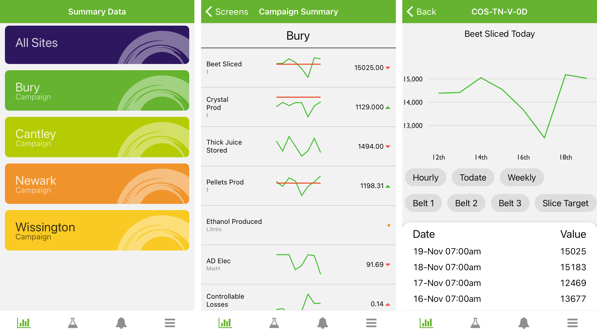
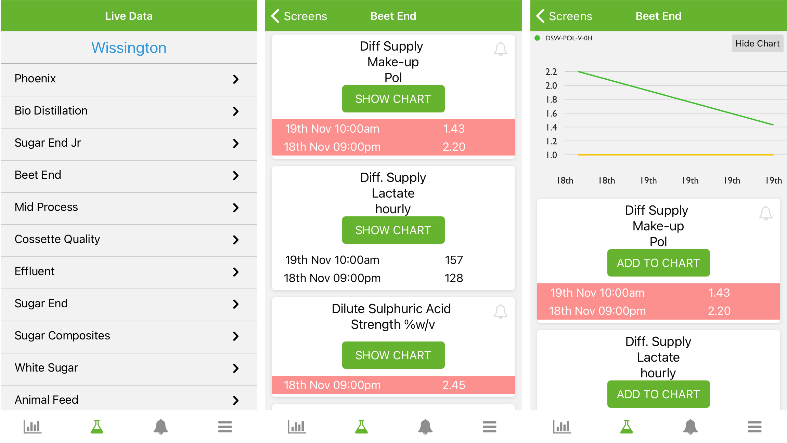
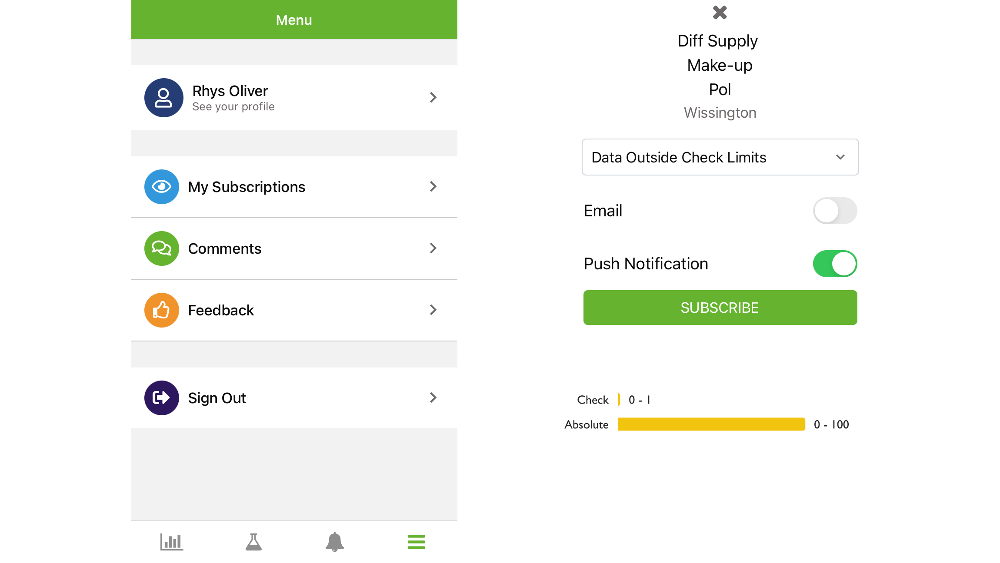

## Oveview

A mobile app was requested to be built to support the web application that had been built for the business to do technical accounting. I was tasked with working with a senior team to develop a mobile app to fit the needs of the business. I was the sole developer on the project so I had to write every line of the code. There were 2 key elements that needed to be satisfied, summary information on performance over a week and live up to date information on current factory performance. The business lacked a clear "At a Glance" view of factory performance that could easily be understood by non-technical users.

## Summary Data

Weekly overviews were required for the all sites, as well as each individual site. I created 1 shared tab, and 4 unique to each site on the homepage. Any number of pages can be added to the tab, to allow a summary of different areas of the business. The app was built to allow these to all be managed within the main web application. When viewing the shared data, the screen can be swiped left and right to view each site side by side for comparison.

The data page was broken down into 3 columns; label, sparkline and data. The sparkline can have both the trended data, along with a target (again managed through the web app), and the data has a chevron to compare performance against the previous day. It is also colour coded to highlight performance changes.

Each data tab can be clicked to see more information, and also then shows links to other related information.

## Live Data

As with the summary pages, live data has a list of different screens for each area of each factory. The key goal was to allow areas to be checked very quickly, this was done with red warnings. Each data point can be set with upper and lower trigger points, when these are breached the row changes to red to highlight an issue.

The data points are organised into cards, and by default only display the last 3 data points (which represents the past 6 hours). A see more button was added to display futher records, to view the past 24 hours performance. Each tab can also be used to display a trend chart, to see how close it may be to a limit.

## Notifications

Within the live data screen, a bell icon is present to allow users to subscribe to a data point. Notifications will then be raised when the conditions of the subscription are met. The subscription can be mixed with the trigger points to only send notifications when the limits are breached (i.e. when there is a problem). This was a massive innovation in the ways of working as area managers are now able to subscribe to the key indicators in their area, and can be notified of issues instantly. Speeding up issue resolution time.

Push notifications can be sent directly to a users device. I had to be careful not to make this feature too intrusive as not everybody wants notifications all the time, especially when they are not working.

## Production Comments

A daily summary is required to be written by area managers each day, and they have always struggled to get the comment in before the morning deadline, as they were usually in the factory resolving issues. The app allows a comment to be written directly from the device, so they don't need to get back to the office to submit their comments for the day. A minor feature, but a great convenience for them.

## Tech Talk

### Tech Stack

The mobile app was written in [React Native](https://reactnative.dev/). One of the key drivers for choosing this language was that our other apps are all built in [React.js](https://reactjs.org/), so it prevented me from needed to learn an entirely new language. Me being the only developer meant that we could move fast in getting the app launched in the 6 month deadline.

Another key driver for [React Native](https://reactnative.dev/) was that its a "Code once, deploy twice" approach, and as the business has a mix android and iOS devices, we couldn't choose one or the other.

The project was built using the [Expo.io](https://expo.io/) platform, which abstracts a massive amount of complexity away from the codebase. Although it bloats the app size, it's well worth it for the simplification that comes with it.
