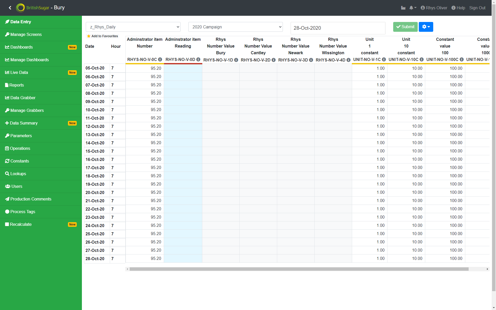
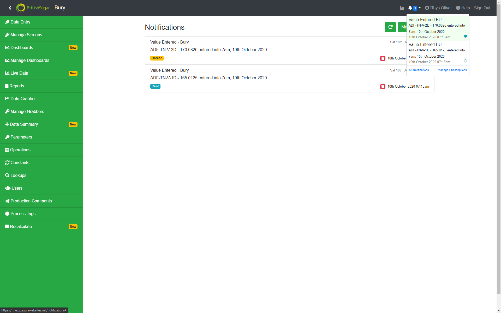
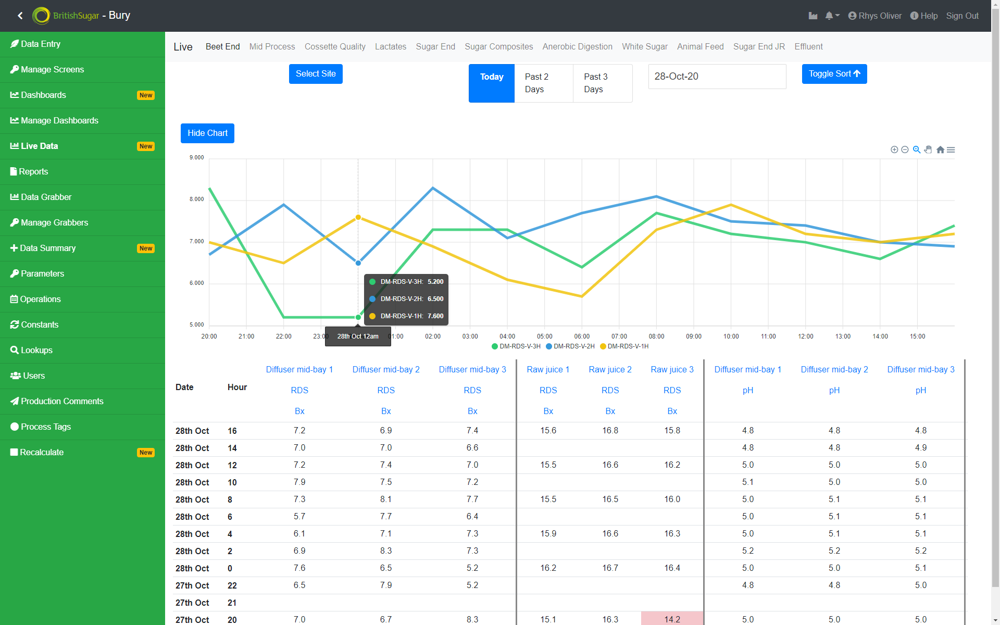
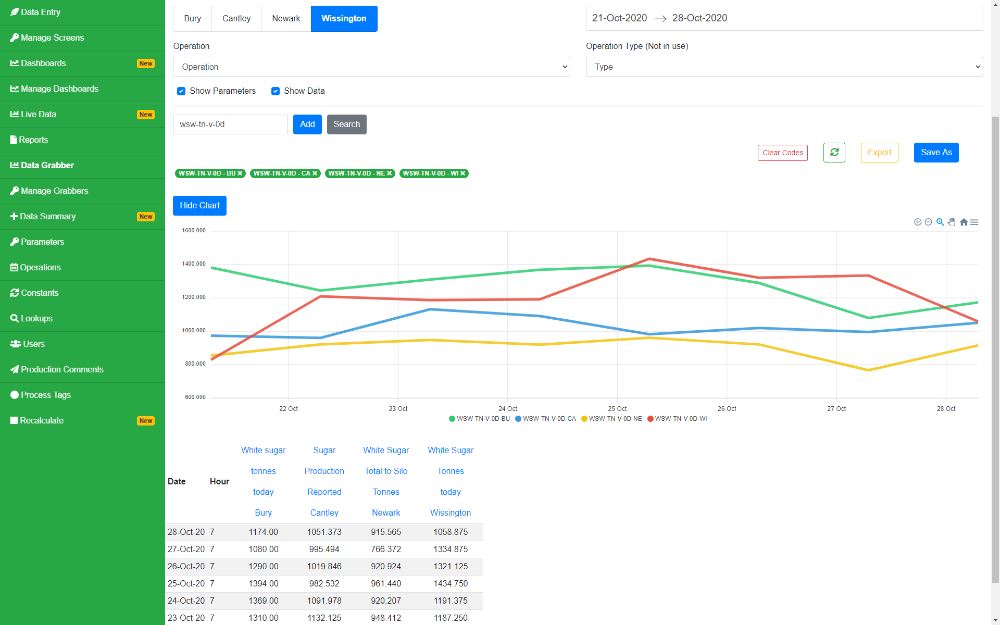
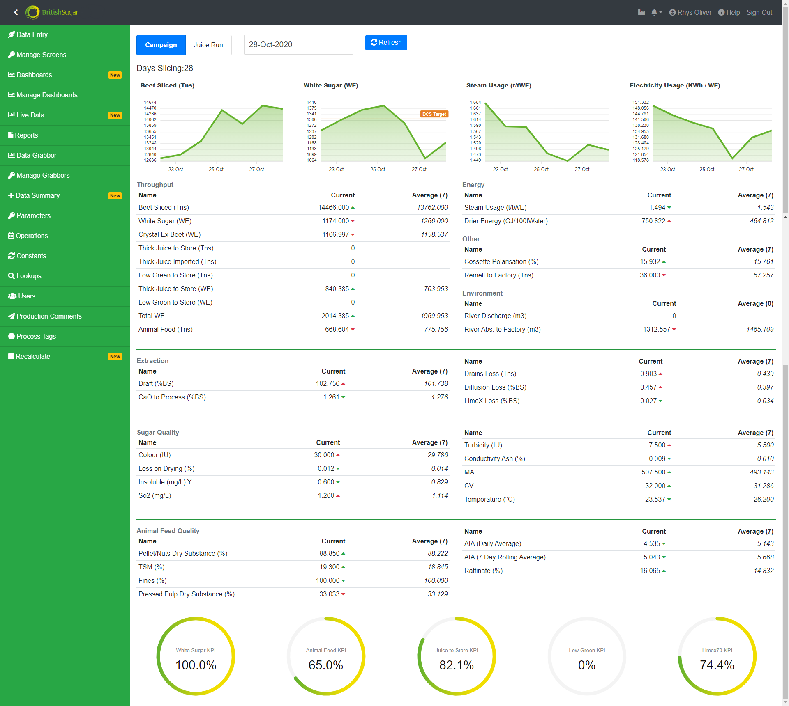

## Overview

FTR is British Sugar's in-house bespoke technical accounting tool. It receives data from multiple data sources and integrates time-bound calculations to provide reporting data from hourly to an entire production run.

I was responsible for transforming the system from an Excel based one, that was backed by a database, into a web application.

## Data Entry

Data can come into FTR in two ways. From an interfacing application, that is processed automatically, or through Data Entry, a manual input. The Data Entry tool allows managers to create and populate a screen with multiple data points (Parameters) that can then be viewed by an analyst and used to enter data, or to simply check the calculation has populated correctly. Each data point can have upper and lower limits applied, that will flag in red when the inputted data might be out of acceptable limits.

## Calculation Engine

Parameters can be a dependency of other parameters, in the form of a calculation. An hourly data point may be linked to a daily sum or mean of that figure. Subsequently, a further daily data point may take that number and apply another calculation to it. Any time data is entered into the system a series of triggers takes place to queue its parents to re-calculate based on the new information, so the system is always up to date. The system currently houses around 25,000 data points, of which over 50% are calculated codes. A key challenge was to make the system fast enough to keep up to date with each data point.

## Subscriptions and Notifications

A subscription feature was implements to allow parameters ton be subscribed to, to allow pro-active monitoring of the system, without the need to keep an eye on the data at all times. Notifications are triggered instantly any time data is inserted into the system, either by an analyst or an automated system. Options can be selected to receive the notification internally in the app, as an email or as a push notification on mobile.

## Live Data

This tool is able to show up to date information on current factory performance. In its basic form it displays tabular data, defined in separate screens. Each data point can be trended at the click of a button. When a single data point is show, the targets are displayed in the chart also, but multiple data points can also be show at the same time. Again, the contents of the pages are fully managed by the admins of the system.

## Data Grabber

A demand for the system was to provide instant information for fast trending and charting capabilities. The data grabber takes Parameter tags and hot-loads data for customisable date-range to quickly fetch data and display charts. Grabbers can be saved personally and kept for later, or even shared amongst a site. An export function was also built to still be able to use the data in Excel or other external applications.

## Dashboards

Dashboards takes the instant information requirement further, by pre-configuring Parameters and Layouts to display a full page overview at the click of a button. Complex dashboards are maintained by the main administrators, but more simple dashboards can be built by trained users.

## Production Comments

Each day area managers are required to do a write up of the previous 24 hours of production, effectively a running commentary of factory performance in each area, along with other information such as health and safety. The comments are then collected from the system and distributed via email to the business.

## Talking Tech

### Tech Stack

The full FTR system is hosted in [Azure](https://azure.microsoft.com/en-us/) through a combination of App Services, Function Apps and Azure SQL Databases. It is the first cloud-based application to be deployed by British Sugar.

The frontend application is built in [React.js](https://reactjs.org/), using [Apex Charts](https://apexcharts.com/) for charting and [Bootstrap](https://getbootstrap.com) for UI elements.

The app is backed by a [Node.js](https://nodejs.org) REST API that is integrated with a [Azure SQL Database](https://azure.microsoft.com/en-gb/services/sql-database/) using [Sequelize](https://sequelize.org/).Function Apps are also written in Node, these apps provide a way to do scheduled jobs (such as emailing the production comments). The

### Site Integration

As the system is integrated with many other applications within the business, a VPN Gateway was setup between the Azure network and local network back on-site.

### Security

The full application has been through a Pen Test and is routinely tested each year to check for security vulnerabilities. Each user signs in with their own account for auditing purposes, and only valid British Sugar email addresses can be used to sign up.
